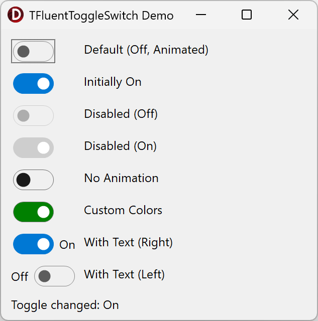

# TFluentToggleSwitch

A VCL component for Delphi that replicates the look and behavior of the Windows 11 ToggleSwitch (WinUI 3 / Fluent Design).

Works on **any version of Windows** (7, 8, 10, 11) with no dependency on system controls or themes. Fully custom-drawn via GDI+.

## Why

Standard VCL does not include a toggle switch. Existing third-party solutions either look outdated or pull in external dependencies. This component:

- Looks like a native Windows 11 toggle — pill-shape track, round thumb, smooth animation
- Independent of Windows version and system theme
- Zero external dependencies — only RTL, VCL, GDI+
- Installs into the Delphi IDE component palette as a standard component

## Features

- Smooth On/Off transition animation (EaseOutCubic, 150 ms) with position and color interpolation
- 8 visual states: Normal / Hover / Pressed / Disabled × On / Off
- WinUI 3 Light Theme color scheme (AccentColor `#0078D4`)
- Customizable colors — override track fill, track border, and thumb colors for On/Off states
- Optional text label — configurable text, position (left/right), and spacing with auto-resize
- Mouse support (click, hover, pressed) and keyboard support (Space, Enter, Tab)
- DPI-aware — correct rendering on high-DPI displays (per-monitor V2)
- Anti-aliased rendering via GDI+
- DoubleBuffered — flicker-free



## Requirements

- **Delphi 12.1** (RAD Studio 12.1 Athens) or compatible version
- Platform: **Windows** (Win32, Win64)

## Project Structure

```
VCL-ToggleSwitch/
├── source/
│   └── ToggleSwitch.pas              — component source code (TFluentToggleSwitch)
├── packages/
│   ├── ToggleSwitch.dpk              — design-time package for IDE installation
│   ├── ToggleSwitch.dproj            — package project file
│   └── ToggleSwitch.res              — package resources
├── demo/
│   ├── Demo.dpr                      — demo application entry point
│   ├── Demo.dproj                    — demo project file
│   ├── Demo.MainForm.pas             — demo form (8 toggle variants)
│   ├── Demo.MainForm.dfm             — demo form layout
│   └── Demo.res                      — demo resources
├── tests/
│   ├── Tests.dpr                     — test runner (DUnitX + FastMM4)
│   ├── Tests.dproj                   — test project file
│   └── ToggleSwitch.Tests.pas        — DUnitX unit tests
├── ToggleSwitch-PG.groupproj         — project group (package + demo + tests)
└── README.md
```

## Quick Start

### 1. Clone the repository

```
git clone https://github.com/Abduction-Lamp/VCL-ToggleSwitch.git
```

### 2. Open in Delphi IDE

Open the project group file:

```
ToggleSwitch-PG.groupproj
```

This will load all three projects: package, demo, and tests.

### 3. Install the component into the IDE palette

1. In Project Manager, find the **ToggleSwitch.bpl** project (packages)
2. Right-click → **Compile** (this places `.dcu` files into the global Dcp directory, making the unit available to all projects)
3. Right-click → **Install**
4. The component `TFluentToggleSwitch` will appear in the **"ToggleSwitch"** tab of the component palette

After this, any new project can simply `uses ToggleSwitch;` — no additional Search Path configuration needed.

### 4. Run the demo

1. In Project Manager, select the **Demo** project
2. Right-click → **Set as Active Project**
3. **Run** (F9)

The demo includes 8 toggle variants: default, initially on, disabled off, disabled on, no animation, custom colors, text label (right), and text label (left).

## Usage

### Design-time (visual)

After installing the package:
1. Drag `TFluentToggleSwitch` from the **"ToggleSwitch"** palette tab onto your form
2. Configure properties in the Object Inspector
3. Assign an `OnChange` event handler

### Runtime (programmatic)

```pascal
uses
  ToggleSwitch;

// Creation
var
  Toggle: TFluentToggleSwitch;
begin
  Toggle := TFluentToggleSwitch.Create(Self);
  Toggle.Parent := Self;
  Toggle.Left := 20;
  Toggle.Top := 20;
  Toggle.OnChange := HandleToggleChange;
end;

// Handling state change
procedure TForm1.HandleToggleChange(Sender: TObject);
begin
  if TFluentToggleSwitch(Sender).Checked then
    ShowMessage('On')
  else
    ShowMessage('Off');
end;
```

### Custom colors

```pascal
Toggle.TrackColorOn := clGreen;
Toggle.TrackColorOff := clSilver;
Toggle.TrackFrameColor := clGray;
Toggle.ThumbColorOn := clWhite;
Toggle.ThumbColorOff := clBlack;
```

Set any color property to `clNone` (default) to use the built-in WinUI 3 color scheme.

### Text label

```pascal
Toggle.ShowText := True;
Toggle.TextOn := 'Enabled';
Toggle.TextOff := 'Disabled';
Toggle.TextPosition := tpRight;  // tpLeft or tpRight
Toggle.TextSpacing := 8;         // pixels between toggle and text
```

The component auto-adjusts its width to fit the longer of the two texts. Text is rendered using the component's `Font` property. Only the toggle track area responds to mouse clicks — the text label is passive.

## Properties

| Property | Type | Default | Description |
|----------|------|---------|-------------|
| `Checked` | `Boolean` | `False` | Toggle state (On/Off) |
| `Animated` | `Boolean` | `True` | Enable smooth transition animation |
| `AnimationDuration` | `Integer` | `150` | Animation duration in milliseconds |
| `Enabled` | `Boolean` | `True` | Whether the component is interactive |
| `TabStop` | `Boolean` | `True` | Include in Tab key navigation |
| `Color` | `TColor` | `clNone` | Background color (clNone = parent color) |
| **Color customization** | | | |
| `TrackFrameColor` | `TColor` | `clNone` | Track border/stroke color |
| `TrackColorOff` | `TColor` | `clNone` | Track fill color when Off |
| `TrackColorOn` | `TColor` | `clNone` | Track fill color when On |
| `ThumbColorOff` | `TColor` | `clNone` | Thumb color when Off |
| `ThumbColorOn` | `TColor` | `clNone` | Thumb color when On |
| **Text label** | | | |
| `ShowText` | `Boolean` | `False` | Show or hide the text label |
| `TextOn` | `string` | `'On'` | Label text when Checked = True |
| `TextOff` | `string` | `'Off'` | Label text when Checked = False |
| `TextPosition` | `TTextPosition` | `tpRight` | Label position: `tpLeft` or `tpRight` |
| `TextSpacing` | `Integer` | `8` | Distance in pixels between toggle and text |
| `Font` | `TFont` | *(inherited)* | Font used for text label rendering |

## Events

| Event | Type | Description |
|-------|------|-------------|
| `OnChange` | `TNotifyEvent` | Fires when the toggle state changes |
| `OnClick` | `TNotifyEvent` | Standard click event (inherited) |

## Keyboard

| Key | Action |
|-----|--------|
| `Tab` | Move focus to/from the component |
| `Space` | Toggle state |
| `Enter` | Toggle state |

## Adding to an Existing Project (without IDE installation)

If you prefer not to install the package, add the source path directly:

1. Open your project in Delphi
2. Go to **Project → Options → Delphi Compiler → Search Path**
3. Add the path to the `source/` folder of this repository
4. Add `uses ToggleSwitch;` to the desired unit

## License

MIT
